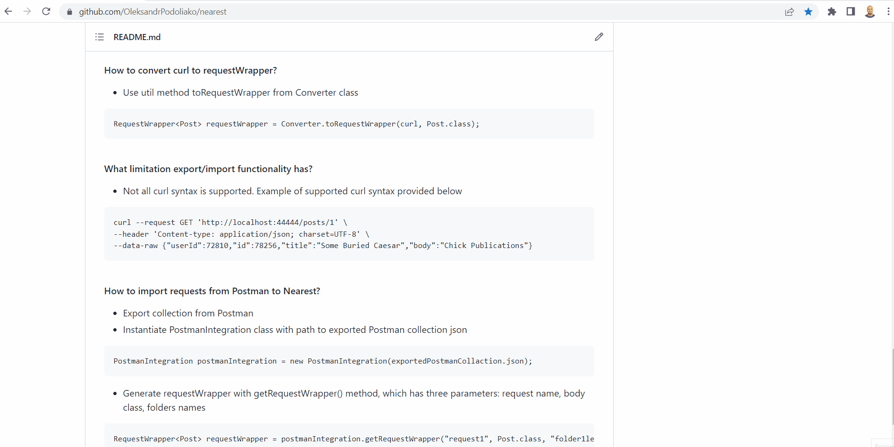

<div style="text-align:center"></div>

### Nearest is a free and open source java library for REST API interactions
[](https://github.com/OleksandrPodoliako/nearest/actions/workflows/testsRun.yml)
[](https://search.maven.org/artifact/io.github.oleksandrpodoliako/nearest)\
[](https://github.com/OleksandrPodoliako/nearest/blob/main/LICENSE)
 \


***

### What is NeaRest?
Nearest is a Rest Assure wrapper for interacting with REST services. Nearest is applicable and efficient for two from three common tasks in automation testing, namely, to test business logic of application and to create pre- / post-conditions for UI tests. Nearest reduces amount of code, which needed to be written for interacting with REST services, by using generics. Nearest provides global logging configuration. Also, Nearest unifies manual and automation verifications by export/import functionality, which allows to use the same requests for both types of testing. Nearest supports import from Postman. Nearest do not limit Rest Assured functionality and provide easy access to it.

Nearest inherent HTTP two level structure. On first level Nearest has RequestWrapper and ResponseWrapper. On second level RequestWrapper has headers and body. ResponseWrapper has body and raw response. Also, Nearest has RestAssuredWrapper, which allow to do more specific actions with raw Rest Assured. Also, Nearest has IRestClient, which contains already implemented CRUD operations.
***

### How to use?

<details> 
  <summary>Please click to watch gif</summary>


</details>

* Add NeaRest to the project
```
<dependency>
    <groupId>io.github.oleksandrpodoliako</groupId>
    <artifactId>nearest</artifactId>
    <version>${LAST_VERSION}</version>
</dependency>
```
* Create POJO model

```
@Getter
@Setter
@Builder
@AllArgsConstructor
@JsonIgnoreProperties(ignoreUnknown = true)
public class Post {
    public int userId;
    public int id;
    public String title;
    public String body;

    public Post() {
    }
}
```

* Create Client class and add interface IRestClient. Specify request's and response's body types in interface

```
public class PostClient implements IRestClient<Post, Post> {
}
```

* Now you can instantiate Client class, which has all CRUD operations implemented

```
public class rest.tests.Main {
    private static final String URL = "https://jsonplaceholder.typicode.com/posts/";

    public static void main(String[] args) {

        RequestWrapper<Post> requestWrapper = RequestWrapper.<Post>builder()
                .url(URL)
                .apiMethod(APIMethod.GET_ARRAY)
                .build();

        ResponseWrapper<Post> responseWrapper = new PostClient().send(requestWrapper);
        
    }
}
```

***

### FAQ

#### How to manage logging?

* Set request and response logging level(By default NONE)

```
NearestConfig.setRequestLogging(RequestLoggingLevel.ALL);
NearestConfig.setResponseLogging(ResponseLoggingLevel.ALL);
```

#### How to switch off mapping to objects?

* Set mapping strategy to NOT_TO_MAP

```
NearestConfig.setMappingStrategy(MappingStrategy.NOT_TO_MAP);
```

#### How to get plain Rest Assured functionality?

* RestAssuredWrapper gives access to plain Rest Assured functionality

```
RestAssuredWrapper.given().when().then();
```

#### How to switch on export all requests to file/console?

<details> 
  <summary>Please click to watch gif</summary>


</details>

* Set export strategy to ExportStrategy.TO_FILE(By default NOT_TO_EXPORT). All requests will be converted to curl and stored to targets/export.txt. File can be changed with NearestConfig.setExportFileName() method

```
NearestConfig.setExportStrategy(ExportStrategy.TO_FILE);
```

#### How to convert specific request to curl?

* Use util method toCurl from Converter class

```
Converter.toCurl(requestWrapper);
```

#### How to convert curl to requestWrapper?

<details> 
  <summary>Please click to watch gif</summary>



</details>

* Use util method toRequestWrapper from Converter class

```
RequestWrapper<Post> requestWrapper = Converter.toRequestWrapper(curl, Post.class);
```

#### What limitation export/import functionality has?

* Not all curl syntax is supported. Example of supported curl syntax provided below

```
curl --request GET 'http://localhost:44444/posts/1' \
--header 'Content-type: application/json; charset=UTF-8' \
--data-raw {"userId":72810,"id":78256,"title":"Some Buried Caesar","body":"Chick Publications"}
```

#### How to import requests from Postman to Nearest?

<details> 
  <summary>Please click to watch gif</summary>


</details>

* Export collection from Postman
* Instantiate PostmanIntegration class with path to exported Postman collection json

```
PostmanIntegration postmanIntegration = new PostmanIntegration(exportedPostmanCollaction.json);
```

* Generate requestWrapper with getRequestWrapper() method, which has three parameters: request name, body class, folders names

```
RequestWrapper<Post> requestWrapper = postmanIntegration.getRequestWrapper("request1", Post.class, "folder1level", "folder2level");
```

***

### Links
The full project-illustration can be found by [link](https://github.com/OleksandrPodoliako/nearest-example)